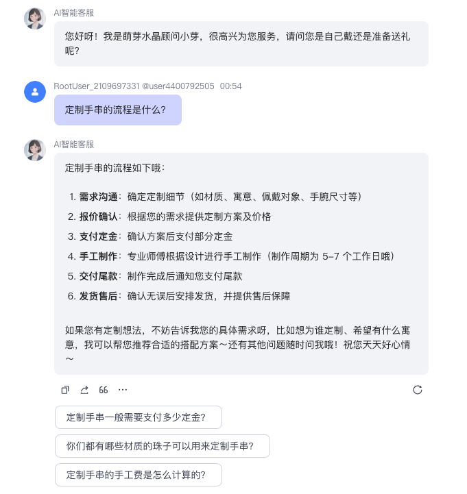
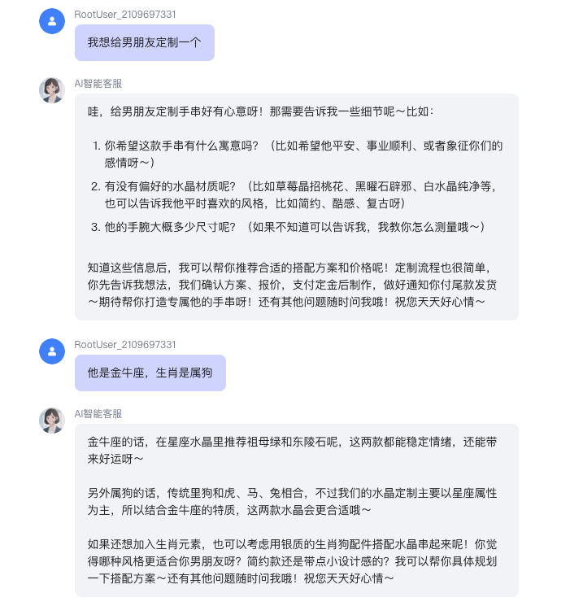
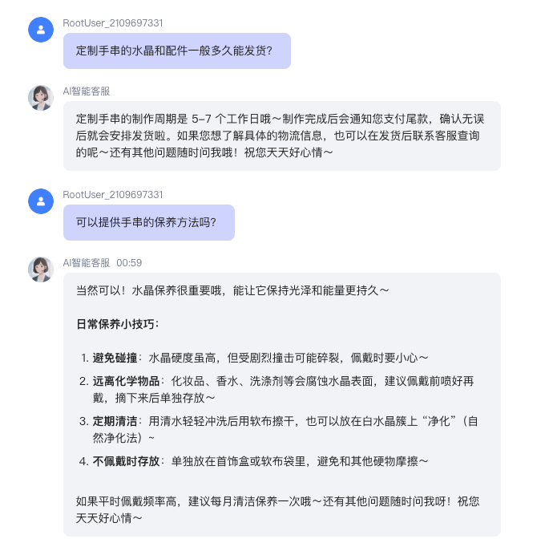

# 小芽客服
基于大模型与 Coze 搭建的智能客服 Demo，用于验证 AI 在企业/电商场景下的应用可行性。

## ✨ 项目简介  
**萌芽商务有限公司（虚拟公司）** 主营水晶手串，目标是通过 AI 智能客服 **小芽**：  
- 提供 7×24 小时的客户咨询服务  
- 支持水晶寓意/尺寸/保养等常见 FAQ  
- 推荐星座/生肖适配的水晶搭配  
- 支持个性化定制与售后服务  
- 提供节日营销话术与用户评价回复  

该 Demo 展示了 AI 在 **客户服务、销售转化与品牌体验** 三个方面的价值。

## 🏗️ 项目背景  
传统电商客服存在以下痛点：  
- 客服成本高，无法 7×24 响应  
- FAQ 回复重复度高，浪费人力  
- 无法主动进行个性化推荐与销售引导  

本项目尝试用 **大模型 + 知识库** 的方式，打造一个虚拟智能客服，提升客户体验与转化率。  

## 🔧 技术方案  

### 1. 技术架构  
- **平台**：Coze（无代码 Bot 搭建平台）  
- **模型**：豆包1.6极速  
- **知识库**：分模块导入（品牌、产品、FAQ、营销、售后、星座、生肖）  
- **提示词工程**：角色设定「小芽」，定义语气、服务边界、对话流程  
- **部署方式**：Coze 提供 Web 链接，可直接体验  

### 2. 知识库模块  
- **品牌与产品**：水晶种类、寓意、规格、保养方法  
- **FAQ**：尺寸选择、净化方式、发货时间  
- **售后**：退换货政策、维修服务  
- **营销**：节日促销、捆绑销售、优惠券策略  
- **用户评价**：好评/差评/中评回复话术  
- **星座 & 生肖**：对应水晶推荐 

## 💡 功能亮点  
1. **智能问答**：自动解答常见问题，准确率 80%+  
2. **个性化推荐**：基于星座/生肖/需求，推荐合适的水晶手串  
3. **定制流程指引**：从需求沟通 → 报价 → 支付 → 制作 → 售后  
4. **营销能力**：结合节日活动和促销话术，主动促进下单  
5. **真实感**：模拟人工客服语气，贴心自然

## 📸 项目截图  

## 🚀 在线体验  
👉 [点击体验小芽 Demo](https://www.coze.cn/store/agent/7549900152732483630?bot_id=true)  
